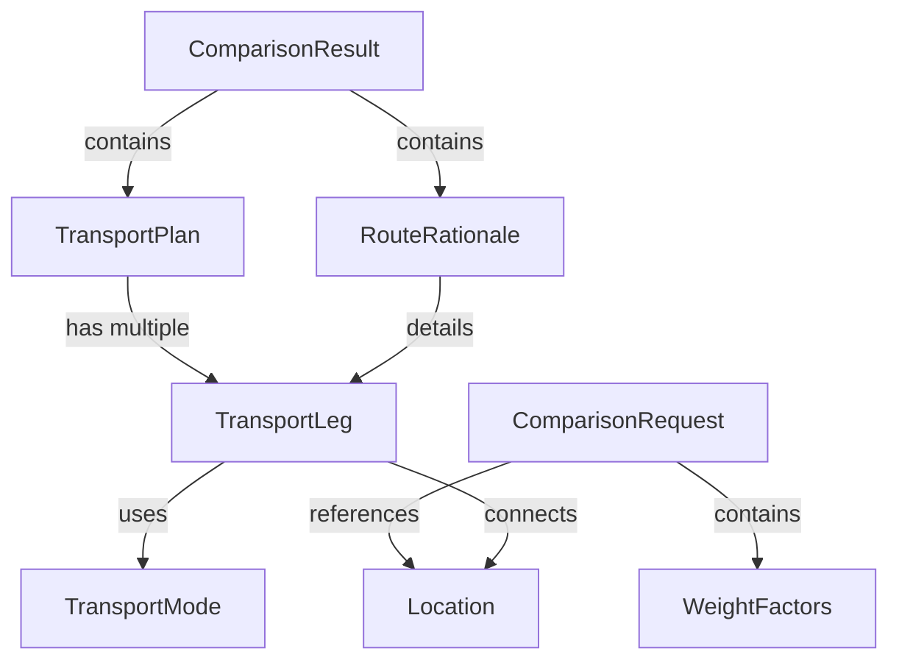

# Data Model Specification

## Overview
This document defines the data structures for the Eco-Route MVP transport comparison system. All models are designed to be shared between frontend and backend via TypeScript interfaces.

## Core Entities

### 1. Location
Represents a geographic point (city or port).

```typescript
interface Location {
  id: string;           // Unique identifier
  name: string;         // Display name (e.g., "Tokyo", "東京港")
  lat: number;          // Latitude (-90 to 90)
  lon: number;          // Longitude (-180 to 180)
  type: LocationType;   // Classification
}

enum LocationType {
  CITY = "city",
  PORT = "port"
}
```

**Validation Rules:**
- `lat` must be between -90 and 90
- `lon` must be between -180 and 180
- `name` must be non-empty string
- `id` must be unique across all locations

### 2. TransportMode
Defines characteristics of a transportation method.

```typescript
interface TransportMode {
  mode: ModeType;               // Mode identifier
  costPerKm: number;            // Cost in JPY per kilometer
  co2KgPerTonKm: number;        // CO2 emissions per ton-kilometer
  avgSpeedKmph: number;         // Average speed in km/h
}

enum ModeType {
  TRUCK = "truck",
  SHIP = "ship"
}
```

**Validation Rules:**
- All numeric values must be positive
- `mode` must be a valid ModeType

### 3. TransportLeg
Represents a single segment of a journey.

```typescript
interface TransportLeg {
  from: string;         // Origin location name
  to: string;           // Destination location name
  mode: ModeType;       // Transportation mode
  distanceKm: number;   // Distance in kilometers
  timeHours: number;    // Duration in hours
}
```

**Validation Rules:**
- `distanceKm` and `timeHours` must be positive
- `from` and `to` must be different
- `mode` must be valid ModeType

### 4. TransportPlan
Represents a complete transportation option.

```typescript
interface TransportPlan {
  plan: PlanType;       // Plan identifier
  timeH: number;        // Total time in hours
  costJpy: number;      // Total cost in Japanese Yen
  co2Kg: number;        // Total CO2 emissions in kg
  legs?: TransportLeg[]; // Route segments (for multi-modal)
}

enum PlanType {
  TRUCK = "truck",
  TRUCK_SHIP = "truck+ship"
}
```

**Validation Rules:**
- All numeric values must be non-negative
- `legs` required for TRUCK_SHIP plan
- Sum of leg times should equal `timeH`

### 5. WeightFactors
User-defined importance weights for optimization.

```typescript
interface WeightFactors {
  time: number;   // Weight for time (0.0 - 1.0)
  cost: number;   // Weight for cost (0.0 - 1.0)
  co2: number;    // Weight for CO2 (0.0 - 1.0)
}
```

**Validation Rules:**
- Each weight must be between 0.0 and 1.0
- Weights will be normalized if sum ≠ 1.0

### 6. ComparisonRequest
Input parameters for route comparison.

```typescript
interface ComparisonRequest {
  origin: string;        // Starting location name
  destination: string;   // Ending location name
  weightKg: number;      // Cargo weight in kilograms
  weights: WeightFactors; // Optimization weights
}
```

**Validation Rules:**
- `origin` and `destination` must be different
- `weightKg` must be positive (> 0)
- `weights` must be valid WeightFactors

### 7. RouteRationale
Detailed explanation of route calculations.

```typescript
interface RouteRationale {
  truck?: {
    distanceKm: number;    // Direct truck distance
  };
  "truck+ship"?: {
    legs: TransportLeg[];  // Detailed route segments
  };
}
```

### 8. ComparisonResult
Complete response from comparison API.

```typescript
interface ComparisonResult {
  candidates: TransportPlan[];    // All evaluated plans
  recommendation: PlanType;       // Recommended plan
  rationale: RouteRationale;       // Calculation details
  metadata?: {
    calculationTimeMs: number;    // Processing time
    dataVersion: string;          // CSV data version
  };
}
```

**Validation Rules:**
- `candidates` must contain at least one plan
- `recommendation` must match one of the candidates
- `rationale` must include details for recommendation

## State Transitions

### Request Processing States
```
RECEIVED → VALIDATING → CALCULATING → COMPLETE
                ↓            ↓
             ERROR ←      ERROR
```

### Data Loading States
```
UNLOADED → LOADING → CACHED → EXPIRED
              ↓                  ↓
           ERROR             LOADING
```

## Data Relationships



## CSV Data Mapping

### modes.csv → TransportMode
```csv
mode,cost_per_km,co2_kg_per_ton_km,avg_speed_kmph
truck,50,0.1,60
ship,20,0.02,20
```

### locations.csv → Location
```csv
id,name,lat,lon,type
1,Tokyo,35.6762,139.6503,city
2,TokyoPort,35.6551,139.7595,port
```

### links.csv → TransportLeg
```csv
from,to,mode,distance_km,time_hours
TokyoPort,OsakaPort,ship,410,20.5
```

## Shared Type Definitions

All types will be defined in `backend/src/lib/shared-types.ts` and imported by both frontend and backend:

```typescript
// backend/src/lib/shared-types.ts
export interface Location { ... }
export interface TransportMode { ... }
export interface TransportLeg { ... }
export interface TransportPlan { ... }
export interface WeightFactors { ... }
export interface ComparisonRequest { ... }
export interface ComparisonResult { ... }
export interface RouteRationale { ... }

export enum LocationType { ... }
export enum ModeType { ... }
export enum PlanType { ... }
```

## Error Response Model

```typescript
interface ErrorResponse {
  error: {
    code: ErrorCode;
    message: string;
    field?: string;      // For validation errors
    details?: any;       // Additional context
  };
  requestId: string;     // Tracking identifier
  timestamp: string;     // ISO 8601 format
}

enum ErrorCode {
  VALIDATION_ERROR = "VALIDATION_ERROR",
  ROUTE_NOT_FOUND = "ROUTE_NOT_FOUND",
  DATA_ERROR = "DATA_ERROR",
  SERVICE_ERROR = "SERVICE_ERROR"
}
```

## Database Considerations

For MVP, data is stored in CSV files on S3. Future migration to DynamoDB would use:

- **Locations Table**: Partition key = `id`
- **Routes Table**: Partition key = `from#to`, Sort key = `mode`
- **Modes Table**: Partition key = `mode`

## Performance Constraints

- Maximum cargo weight: 100,000 kg
- Maximum route segments: 10
- Maximum response time: 2 seconds
- Cache TTL: 15 minutes

## Version Management

Data model version: **1.0.0**

Breaking changes will require:
1. New version number (MAJOR increment)
2. Migration strategy
3. Backward compatibility period